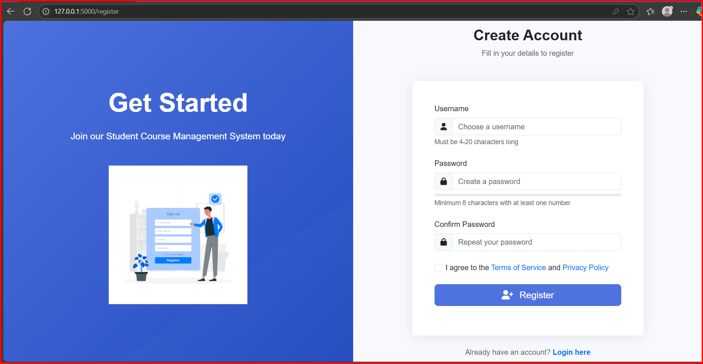

# EduManage – Student Course Management System


**EduManage** is a Flask-based web application for managing students, courses, and enrollments using a PostgreSQL backend. It showcases extensive SQL feature integration and a modern responsive frontend.

---

## 🚀 1. Project Overview

EduManage helps educational institutions efficiently manage students, courses, enrollments, grades, and academic reports. It includes:

- Secure user authentication
- Student & course management
- Enrollment with capacity control
- Grade tracking and GPA reports
- Audit logging with triggers
- API endpoints for integration

---

## 🌐 Deploying to Vercel

### Prerequisites
1. Create an account on [Vercel](https://vercel.com)
2. Install the Vercel CLI: `npm install -g vercel`

### Deployment Steps
1. Login to Vercel CLI: `vercel login`
2. From the project root directory, run: `vercel`
3. Follow the prompts to configure your project
4. To deploy to production: `vercel --prod`

The application is pre-configured with environment variables in the code and uses a WSGI entry point for better compatibility with Vercel's serverless environment. No need to set environment variables in Vercel dashboard as they're already included in the code.

---

## 🧰 2. Technology Stack

| Layer       | Technology                             |
|-------------|-----------------------------------------|
| **Frontend**| HTML5, Bootstrap 5, JavaScript           |
| **Backend** | Python 3.8+, Flask Framework            |
| **Database**| PostgreSQL 12+                          |
| **Auth**    | Flask-Login, Werkzeug password hashing  |

---

## ⚙️ 3. Installation Guide

### Step 1: Clone the repository
```bash
git clone https://github.com/yourusername/EduManage.git
cd EduManage
```

### Step 2: Install dependencies
```bash
pip install -r requirements.txt
```

### Step 3: Run the application
```bash
python wsgi.py
```

Note: The project is configured with environment variables directly in the main.py file for easier deployment to Vercel.

Visit `http://127.0.0.1:5000/` in your browser.

---

## 🗂️ 4. Project Structure

```
EduManage/
├── Screenshots/
├── templates/
├── .gitignore
├── LICENSE
├── main.py
├── README.md
├── requirements.txt
├── vercel.json
└── wsgi.py
```

---

## 🖼️ 5. Application Screenshots

> These screenshots showcase major features and UI of the EduManage system.

**Login Page**  


**Register Page**  


**Home Page**  


**Add Student**  


**Update Student**  


**Add Course**  


**Course Grade Update**  


**Audit Log**  


**Student Info**  


**Reports**  
  


**Landing Pages**  
  


---

## 🧠 6. SQL Features Implemented

- ✅ DDL (CREATE TABLE)
- ✅ DML (INSERT, UPDATE, DELETE)
- ✅ Stored Procedures
- ✅ Cursors and Exception Handlers
- ✅ Nested Queries and Joins
- ✅ User-Defined Functions
- ✅ Triggers for auditing

---

## 🧪 7. Usage Instructions

- Visit `/register` to create an account
- Access dashboard after login at `/home`
- Manage students/courses/enrollments via dashboard
- Use reports for GPA and performance analytics
- View audit log of student changes at `/audit_log`

---

## 🤝 8. Contribution Guidelines

1. Fork the repository
2. Create a new branch (`git checkout -b feature-name`)
3. Commit your changes (`git commit -am 'Add new feature'`)
4. Push to the branch (`git push origin feature-name`)
5. Create a pull request

---

## 📜 9. License Information

This project is licensed under the **MIT License**.  
See the [LICENSE](LICENSE) file for details.

---

> Developed by **Vansh Sambhaji Gosavi**  
> 📧 vanshgosavi7@gmail.com | 📱 +91-9359775740
